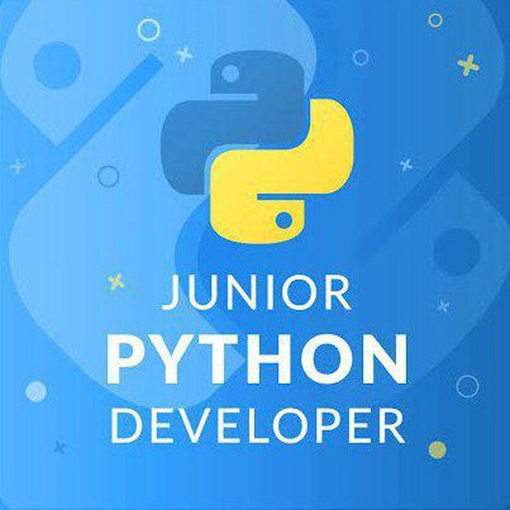
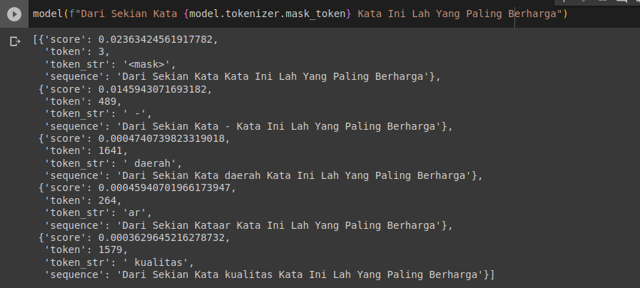
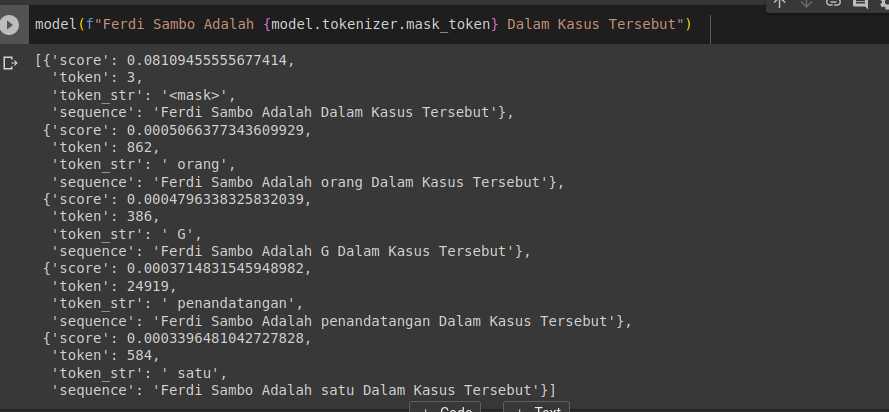
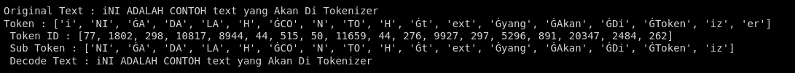

# NLP Project By Python Newbie
<p align="center"></p>

NLP (Natural Language Processing) adalah cabang dari kecerdasan buatan yang berhubungan dengan interaksi antara komputer dan manusia menggunakan bahasa alami, di project ini kita mengembangkan NLP yang menggunakan bahasa Indonesia Yang Bersifat Open Source Yang Digagas Oleh Anggota Grup Python Newbie.

Dalam project ini Kita bertujuan untuk mengembangkan NLP khusus bahasa Indonesia agar bisa lebih akurat dan presisi guna mendapatkan hasil yang maksimal dalam berinteraksi dengan komputer

## Index List
- [Sumber Dataset](#Sumber_Dataset)
- [Dataset](#Dataset)
- [Fill Mask](#Fill_Mask)
- [Tokenizer](#Tokenizer)
- [Collabolator](#Collabolator)
- [Scraping](https://github.com/staykimin/nlp_project/tree/kimin/Scraping)


## Sumber_Dataset
Pengumpulan dataset menggunakan teknik scraping dari bebagai artikel berita nasional yang meliputi :

- [Antara News](https://www.antaranews.com/)
## Dataset
- [Dataset Antara News](https://raw.githubusercontent.com/staykimin/nlp_project/kimin/Dataset/datasetv1.min)

Dataset Disimpan Dalam Format JSON dan Memiliki Beberapa Parameter Antara Lain

| Parameter | Type     | Description                |
| :-------- | :------- | :------------------------- |
| `id` | `integer` | ID Dari Dataset |
| `id_sumber` | `integer` | ID Dari Sumber Dataset |
| `link_sumber` | `text` | Link Dari Artikel |
| `judul` | `text` | Judul Dari Artikel |
| `raw_text` | `text` | Isi Content / Artikel Tersebut |
| `publised_date` | `text` | Tanggal Publish Artikel |

| ID Sumber | Website Name     |
| :-------- | :------- |
| `1` | `Antara News` |

## Fill_Mask
Downlad Model Terlebih Dahulu Pada Link Berikut
```bash
https://drive.google.com/drive/folders/1g9Kfu3gNggyNgQucgLcUsUSENc9Gsad7?usp=drive_link
```
Install Transformers Terlebih Dahulu
```bash
pip install transformers
```
Import Pipeline Yang Ada Pada Transformers
```python
from transformers import pipeline
```
Load Model Menggunakan Media Pipeline
```python
model = pipeline('fill-mask', model='kimin-nlp', tokenizer='kimin-nlp')
```
Proses Fill Mask
```python
print(model(f"Dari Sekian Kata {model.tokenizer.mask_token} Kata Ini Lah Yang Paling Berharga"))
```
<p text-align="justify"></p>
<p text-align="justify"></p>

## Tokenizer
Tokenizer Dilakukan Menggunakan library Transformers Dengan Metode byte-level
## Instalasi & Runing Program

Instalasi Modul Yang Di perlukan
```python
pip install transformers
```
Import Library Ke Dalam Script Python
```python
from tokenizers.implementations import ByteLevelBPETokenizer
```
Import Model
```python
tokenizer = ByteLevelBPETokenizer.from_file("/model/kimin_tokenizer-vocab.json", "/model/kimin_tokenizer-merges.txt")
```
Proses tokenizer
```python
text= "iNI ADALAH CONTOH text yang Akan Di Tokenizer"
encoded = tokenizer.encode(text)
tokens = encoded.tokens
token_ids = encoded.ids
sub_tokens = encoded.tokens[1:-1]
```
Proses Decode Token
```python
decoded_text = tokenizer.decode(encoded.ids)
```



## Contact

Untuk Contact Person, Bisa Langsung Gabung Pada Link Grup WA Berikut

- [Belajar Python Newbie](https://chat.whatsapp.com/KVgG1OgRWJm14U3JpLqEhR)


